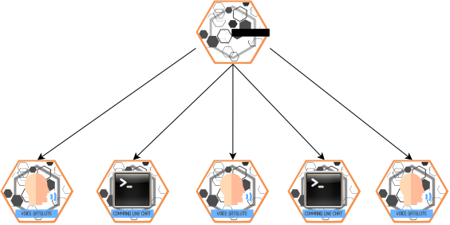

<p align="center">
  
</p>

HiveMind is a community-developed superset or extension of [OpenVoiceOS](https://github.com/OpenVoiceOS/), the open-source voice assistant.

With HiveMind, you can extend one (or more, but usually just one!) instance of ovos-core to as many devices as you want, including devices that can't ordinarily run OpenVoiceOS!

HiveMind's developers have successfully connected to OpenVoiceOS from a PinePhone, a 2009 MacBook, and a Raspberry Pi 0, among other devices. OpenVoiceOS itself usually runs on our desktop computers or our home servers, but you can use any OpenVoiceOS-branded device as your central unit.

Work in progress documentation can be found in the [docs](https://jarbashivemind.github.io/HiveMind-community-docs)

You can also join the [Hivemind Matrix chat](https://matrix.to/#/#jarbashivemind:matrix.org) for general news, support and chit chat

# Usage

```
$ hivemind-core --help
Usage: hivemind-core [OPTIONS] COMMAND [ARGS]...

Options:
  --help  Show this message and exit.

Commands:
  add-client     add credentials for a client
  delete-client  remove credentials for a client
  list-clients   list clients and credentials
  listen         start listening for HiveMind connections


$ hivemind-core add-client --help
Usage: hivemind-core add-client [OPTIONS] [NAME] [ACCESS_KEY] [PASSWORD]
                                [CRYPTO_KEY]

  add credentials for a client

Options:
  --help  Show this message and exit.


$ hivemind-core listen --help
Usage: hivemind-core listen [OPTIONS]

  start listening for HiveMind connections

Options:
  --host TEXT             HiveMind host
  --port INTEGER          HiveMind port number
  --ovos_bus_address TEXT Open Voice OS bus address
  --ovos_bus_port INTEGER Open Voice OS bus port
  --ssl BOOLEAN           use wss://
  --cert_dir TEXT         HiveMind SSL certificate directory
  --cert_name TEXT        HiveMind SSL certificate file name
  --help                  Show this message and exit.


$ hivemind-core delete-client --help
Usage: hivemind-core delete-client [OPTIONS] NODE_ID

  remove credentials for a client

Options:
  --help  Show this message and exit.


$ hivemind-core list-clients --help
Usage: hivemind-core list-clients [OPTIONS]

  list clients and credentials

Options:
  --help  Show this message and exit.

```

By default HiveMind listens for the Open Voice OS bus on `127.0.0.1` which should not be changed when running as the same place. In some cases such as Kubernetes when the HiveMind Listener and Open Voice OS bus are in different pods, the HiveMind Listener should be able to connect to the pod address by using the `ovos_bus_address` and `ovos_bus_port` options.

# Protocol

| Protocol Version     | 0   | 1   |
| -------------------- | --- | --- |
| json serialization   | yes | yes |
| binary serialization | no  | yes |
| pre-shared AES key   | yes | yes |
| password handshake   | no  | yes |
| PGP handshake        | no  | yes |
| zlib compression     | no  | yes |

some clients such as HiveMind-Js do not yet support protocol V1

# HiveMind components



## Client Libraries

- [HiveMind-websocket-client](https://github.com/JarbasHiveMind/hivemind_websocket_client)
- [HiveMindJs](https://github.com/JarbasHiveMind/HiveMind-js)

## Terminals

- [Remote Cli](https://github.com/OpenJarbas/HiveMind-cli) **\<-- USE THIS FIRST**
- [Voice Satellite](https://github.com/OpenJarbas/HiveMind-voice-sat)
- [Flask Chatroom](https://github.com/JarbasHiveMind/HiveMind-flask-template)
- [Webchat](https://github.com/OpenJarbas/HiveMind-webchat)

## Bridges

- [Mattermost Bridge](https://github.com/OpenJarbas/HiveMind_mattermost_bridge)
- [HackChat Bridge](https://github.com/OpenJarbas/HiveMind-HackChatBridge)
- [Twitch Bridge](https://github.com/OpenJarbas/HiveMind-twitch-bridge)
- [DeltaChat Bridge](https://github.com/JarbasHiveMind/HiveMind-deltachat-bridge)

## Minds

- [NodeRed](https://github.com/OpenJarbas/HiveMind-NodeRed)
