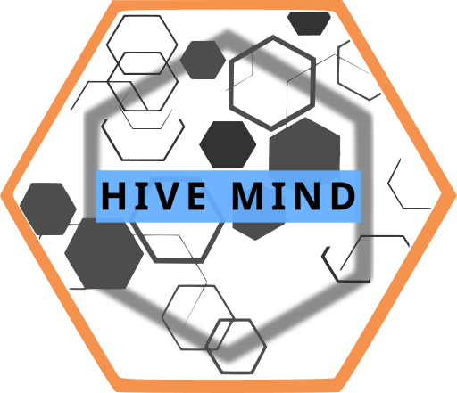
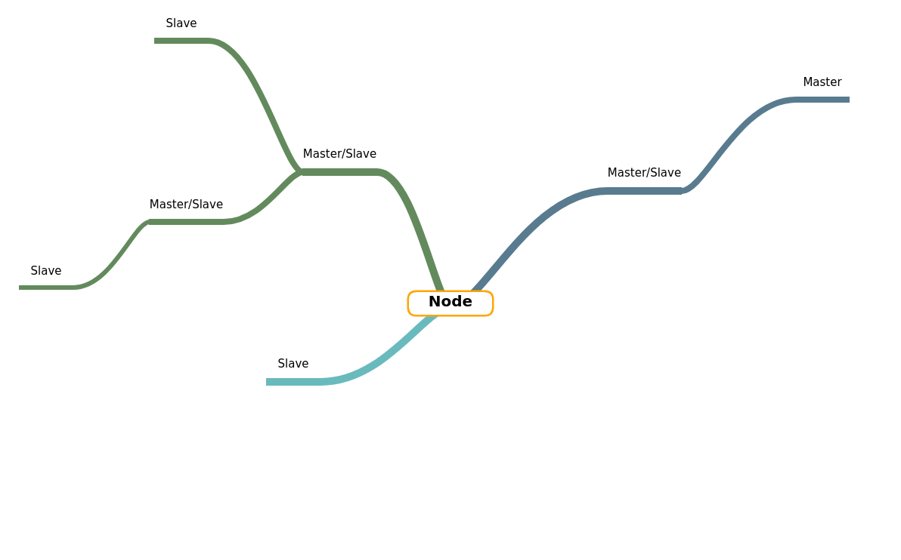

  

# Stats:

|   |  |
|:---:|:---:|
| Please :star: this repo if you find it useful| This shows when this repo was updated for the last time |
||  |
| I'm using the Apache License 2.0 similar as Mycroft A.I. which means commercial use is allowed | If you have any ideas, they're always welcome.  Either submit an issue or a PR! |
|  |  |
| If you feel the need, now it's as easy as clicking this button!  | You can help sponsoring HiveMind continued development with recurring donations|

# Getting started

At this moment development is in very early stages. 
You will need to look around existing projects and examples folder until documentation is written and the project a little more polished

# Components

Hivemind spans several projects, see links bellow for the current ecosystem

check [examples](./examples) for setup

- run add_keys to add authorized connection
- run mycroft_master in mycroft device

## Terminals

- [Remote Cli](https://github.com/OpenJarbas/HiveMind-cli)
- [Voice Satellite](https://github.com/OpenJarbas/HiveMind-voice-sat)
- [Flask Chatroom](https://github.com/OpenJarbas/HiveMind-flask-chatroom)
- [Webchat](https://github.com/OpenJarbas/HiveMind---Webchat-Terminal)
- [REST (https) Terminal]() - Coming soon
- [MQTT Terminal]() - Coming soon

## Bridges

- [Mattermost Bridge](https://github.com/OpenJarbas/HiveMind_mattermost_bridge)
- [HackChat Bridge](https://github.com/OpenJarbas/HiveMind-HackChatBridge)
- [Twitch Bridge](https://github.com/OpenJarbas/HiveMind-twitch-bridge)
- [Facebook Bridge]() - Coming soon
- [Twitter Bridge]() - Coming soon
- [MQTT Bridge]() - Coming soon

## Nodes

- [NodeRed](https://github.com/OpenJarbas/HiveMind-NodeRed)
- [Rendevouz Node]() - Coming soon
- [Flask Microservices Node]() - Coming soon

# Data flow

The hivemind can be seen as a global mycroft bus shared across devices

Bellow are some planned data flows and message types

Documentation coming soon

Red - original message

Yellow - reply message

#### Broadcast

propagate message to all slaves

#### Propagate

Send message to all slaves and masters

#### Escalate

Send message up the authority chain, never to a slave

# Credits

[JarbasAl](https://liberapay.com/jarbasAI/)

[AIIX](https://github.com/AIIX/) - hivemind logo
