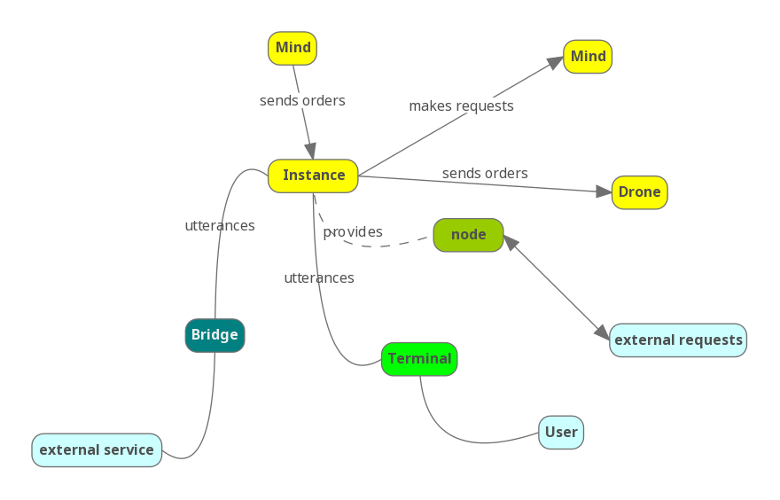
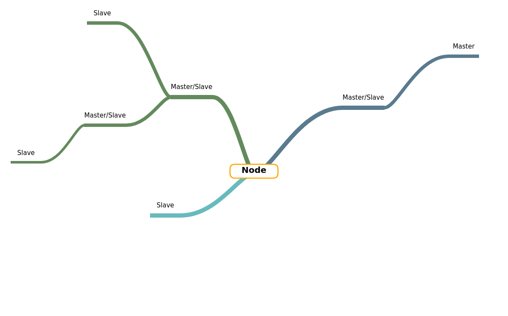

# HiveMind

check [examples](./examples) for setup

- run add_keys to add authorized connection
- run mycroft_master in mycroft device

## Terminals

- [Remote Cli](https://github.com/OpenJarbas/HiveMind-cli)
- [Voice Satellite](https://github.com/OpenJarbas/HiveMind-voice-sat)
- [Webchat Satellite]() - Coming soon
- [Https Bridge]() - Coming soon
- [MQTT Terminal]() - Coming soon

## Bridges

- [HackChat Bridge](https://github.com/OpenJarbas/HiveMind-HackChatBridge)
- [Twitch Bridge]() - Coming soon
- [Facebook Bridge]() - Coming soon
- [Twitter Bridge]() - Coming soon
- [MQTT Bridge]() - Coming soon

## Nodes

- [Rendevouz Node]() - Coming soon
- [Flask Microservices Node]() - Coming soon

### Mesh Networkin

The glocal mycroft bus

Red - original message

Yellow - reply message

#### Broadcast

propagate message to all slaves

#### Propagate

Send message to all slaves and masters

#### Escalate

Send message up the authority chain, never to a slave

#### Ask

Send message up the authority chain until first answer, also forwarded
to slaves

#### Cascade

Propagate message and receive answers from everyone

#### Rendevouz

Propagate message until response is found and send response trough
Rendevouz/Router Node

